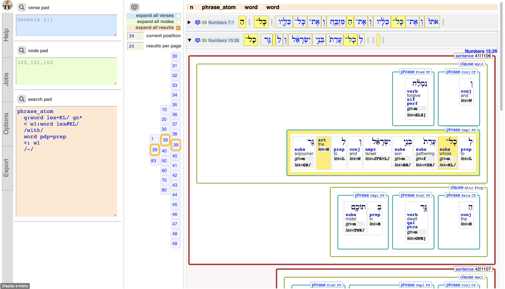

# BHSA

[ Software Heritage Archive](https://archive.softwareheritage.org/browse/origin/https://github.com/annotation/app-bhsa/)

This is a
[Text-Fabric](https://github.com/annotation/text-fabric) app
for working with the
[BHSA](https://etcbc.github.io/bhsa/) corpus: the Hebrew Bible.

Get started with the
[tutorial](https://nbviewer.jupyter.org/github/annotation/tutorials/blob/master/bhsa/start.ipynb).

